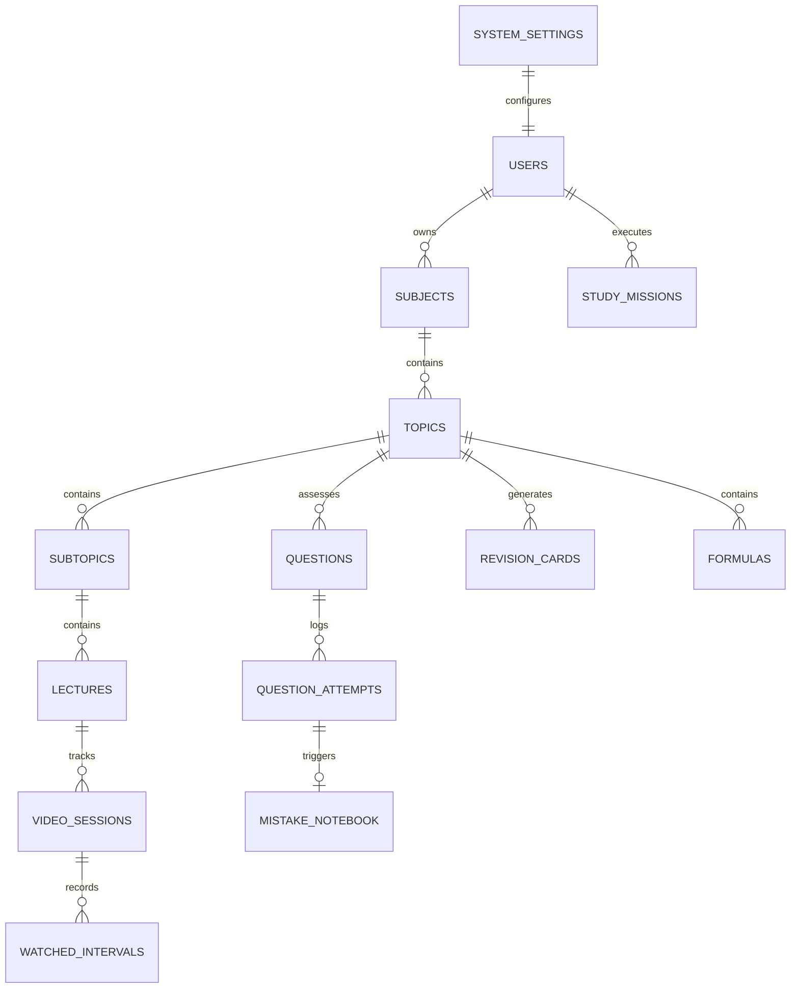

# Supabase PostgreSQL Data Model Specification

## 1. Schema Overview & Entity Relationship Diagram

The PostgreSQL database models the complete GATE preparation life cycle. Foreign keys enforce referential integrity, and cascading deletions are restricted on core curriculum tables to prevent accidental syllabus data loss.



## 2. Core Tables Specification

### `system_settings`
* `id` (UUID, Primary Key, default `gen_random_uuid()`)
* `user_id` (UUID, UNIQUE, Foreign Key -> `users.id`)
* `target_branch` (TEXT, default 'CS')
* `target_exam_date` (TIMESTAMPTZ, NOT NULL, default '2028-02-05 09:30:00+05:30')
* `timezone` (TEXT, default 'Asia/Kolkata')
* `weekday_availability_json` (JSONB, NOT NULL, default '{"monday": 180, "tuesday": 180, "wednesday": 180, "thursday": 180, "friday": 180, "saturday": 360, "sunday": 360}')
* `ai_provider` (TEXT, default 'nvidia')
* `ai_model` (TEXT, default 'zzlm-5.2')
* `ai_monthly_budget_inr` (NUMERIC, default 1000.00)
* `ai_warning_thresholds_json` (JSONB, default '[70, 90, 100]')
* `updated_at` (TIMESTAMPTZ, default `now()`)

### `subjects`
* `id` (UUID, Primary Key)
* `title` (TEXT, NOT NULL, e.g. "Data Structures", "Operating Systems")
* `code` (TEXT, UNIQUE, e.g. "CS_DS", "CS_OS")
* `weightage_marks` (NUMERIC(4,2), default `8.00`)
* `order_index` (INT, NOT NULL)

### `questions` (Enhanced PYQ Audit Metadata)
* `id` (UUID, Primary Key)
* `topic_id` (UUID, Foreign Key -> `topics.id`)
* `gate_year` (INT, NOT NULL)
* `paper_session` (TEXT, default 'S1')
* `question_number` (INT, NOT NULL)
* `question_type` (TEXT, CHECK in ('MCQ', 'MSQ', 'NAT'))
* `marks` (NUMERIC(3,1), NOT NULL)
* `negative_marks` (NUMERIC(3,1), default 0.0)
* `stem_text` (TEXT, NOT NULL)
* `options_json` (JSONB)
* `correct_answer_json` (JSONB, NOT NULL)
* `nat_tolerance_min` (NUMERIC)
* `nat_tolerance_max` (NUMERIC)
* `explanation` (TEXT)
* `is_official_pyq` (BOOLEAN, default TRUE)
* `verification_status` (TEXT, CHECK in ('VERIFIED', 'UNVERIFIED', 'FLAGGED'), default 'VERIFIED')
* `source_reference` (TEXT)
* `import_batch_id` (UUID)
* `created_at` (TIMESTAMPTZ, default `now()`)

### `formulas` (Hybrid Seeded + Personal Model)
* `id` (UUID, Primary Key)
* `topic_id` (UUID, Foreign Key -> `topics.id`)
* `title` (TEXT, NOT NULL)
* `expression_latex` (TEXT, NOT NULL)
* `variable_definitions_json` (JSONB)
* `conditions` (TEXT)
* `is_seeded` (BOOLEAN, default FALSE) -- Distinguishes seed dataset formulas from personal user formulas
* `is_hidden` (BOOLEAN, default FALSE)
* `user_notes` (TEXT)
* `verification_status` (TEXT, CHECK in ('VERIFIED', 'UNVERIFIED'), default 'VERIFIED')
* `created_at` (TIMESTAMPTZ, default `now()`)

### `ai_usage_logs`
* `id` (UUID, Primary Key)
* `capability_id` (TEXT, NOT NULL)
* `tokens_used` (INT, NOT NULL)
* `cost_estimated_inr` (NUMERIC(6,2), NOT NULL)
* `timestamp` (TIMESTAMPTZ, default `now()`)

## 3. Database Indexes & Performance Tuning

```sql
CREATE INDEX idx_system_settings_user_id ON system_settings(user_id);
CREATE INDEX idx_questions_pyq_audit ON questions(gate_year, paper_session, question_number);
CREATE INDEX idx_formulas_topic_seeded ON formulas(topic_id, is_seeded, is_hidden);
CREATE INDEX idx_ai_usage_monthly ON ai_usage_logs(timestamp);
```
