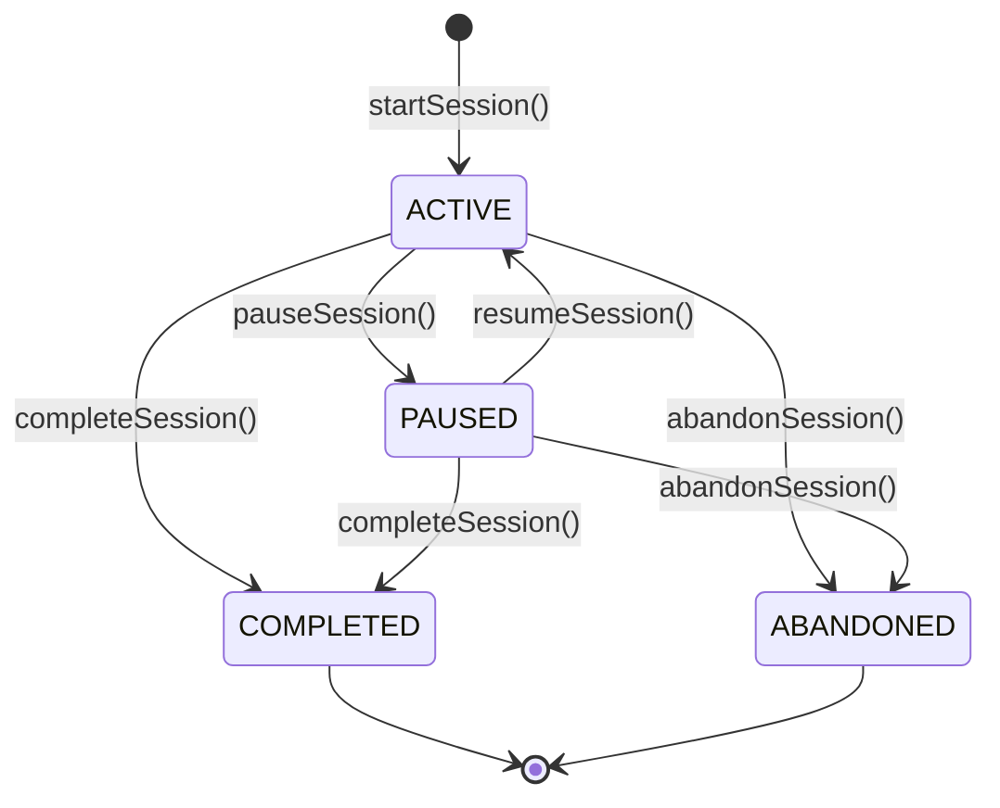
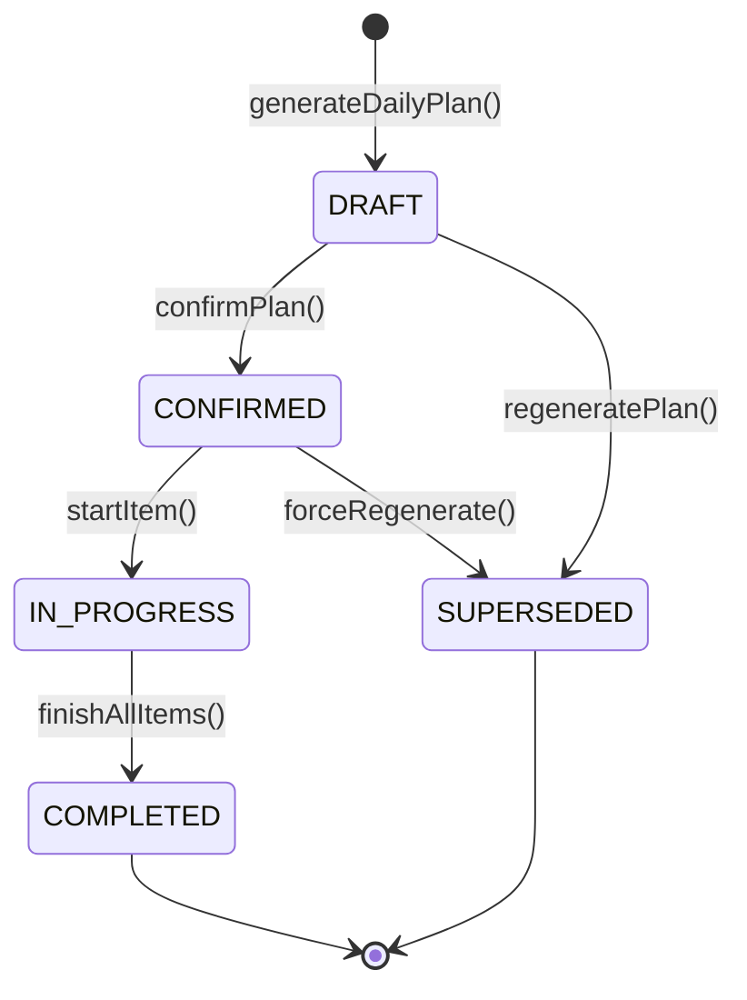
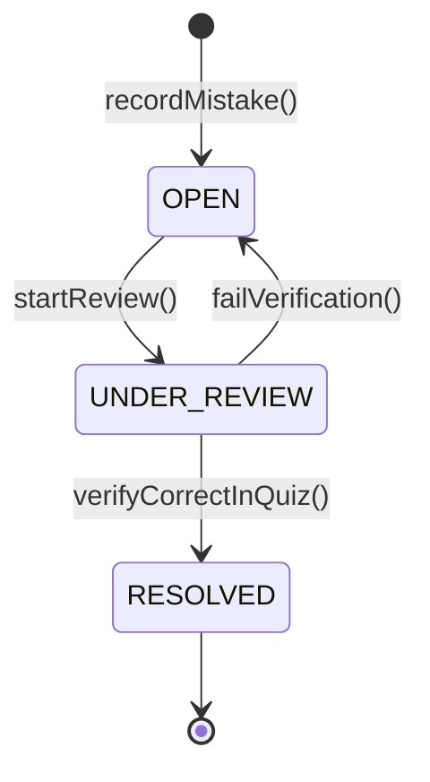

# State Machines Specification

> **GATE AIR-1 Command Center** · System Entity State Transitions

---

## 1. Study Session State Machine

Valid transitions enforced in [`src/server/services/adaptive.service.ts`](file:///c:/Users/yaksh/Downloads/personal%20gate/src/server/services/adaptive.service.ts).

---

## 2. Daily Plan State Machine

---

## 3. Mistake Item State Machine

Enforced in [`src/server/services/mistake.service.ts`](file:///c:/Users/yaksh/Downloads/personal%20gate/src/server/services/mistake.service.ts).
