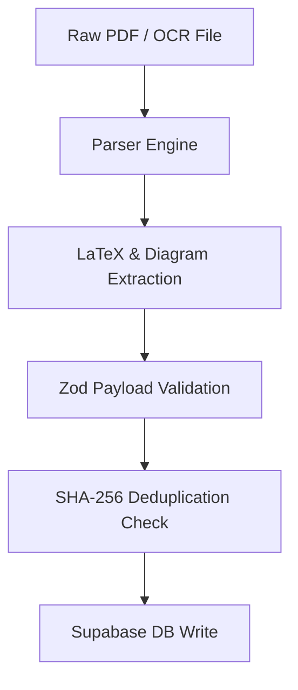

# Phase 9: PYQ Ingestion Pipeline Specification

## Pipeline Architecture

The Phase 9 PYQ Ingestion Engine converts raw PDF exam papers, OCR outputs, and structured JSON files into normalized, validated database entries.

### Stage Description
- **Extraction**: Separates question stem, options, diagrams, and official key.
- **Normalizer**: Standardizes mathematical formatting into KaTeX compliant syntax.
- **Deduplication Engine**: Calculates SHA-256 fingerprint over normalized statement to prevent duplicate entries across sets.
